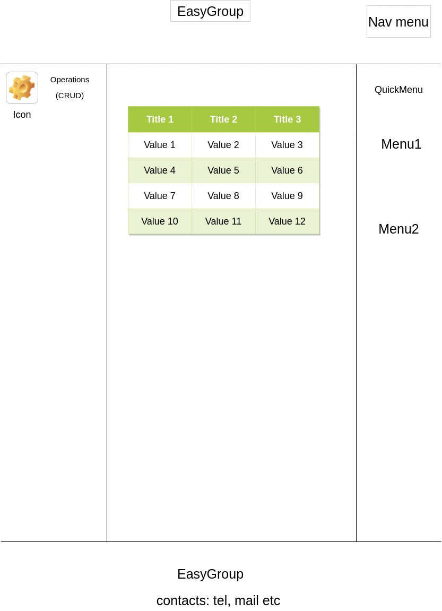

<h1>CrowdProj project - prod-groups </h1>

Prod-groups is a microservice for defining product groups, describing common properties for similar products. Готовое
SAAS решение для маркетплейсов.

<h2> What's new in the project</h2>
Compared to the previous version , the following changes have appeared: not yet

<h2> Визуальная схема фронтенда</h2>

<h2> Документация </h2>
<ol> 
<li>Маркетинг</li>
    <ol type="i">
        <li> <a href="m2-prepare/marketing/StakeholdersList.md">Stakeholders list </a> </li>
        <li> <a href="m2-prepare/marketing/TargetGroup.md"> Target group </a> </li>
        <li> <a href="m2-prepare/marketing/CompetiveAnalysis.md">  Competitive analysis</a></li>
        <li><a href="m2-prepare/marketing/EconomicAnalysis.md">  Economic analysis</a></li>
        <li><a href="m2-prepare/marketing/UserStories.md"> User stories</a></li>
    </ol>
<li>Devops</li>
    <ol type="i">
        <li><a href="m2-prepare/marketing/InfrastructureSchema.md">Infrastructure schema </a></li>
        <li><a href="./m2-prepare/MonitoringSchema.md">Monitoring schema</a></li>
    </ol>
<li>Tests</li>
<li>Architecture</li>
    <ol type="i">
        <li>Компонентная схема</li>
        <li>Интеграционая схема</li>
        <li>Описание API</li>
    </ol>
</ol>    
    